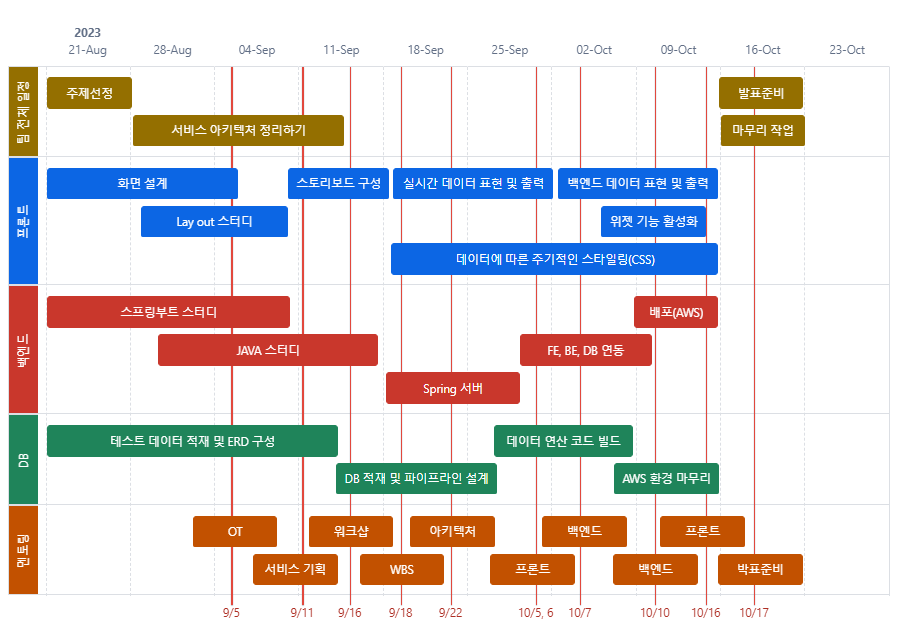
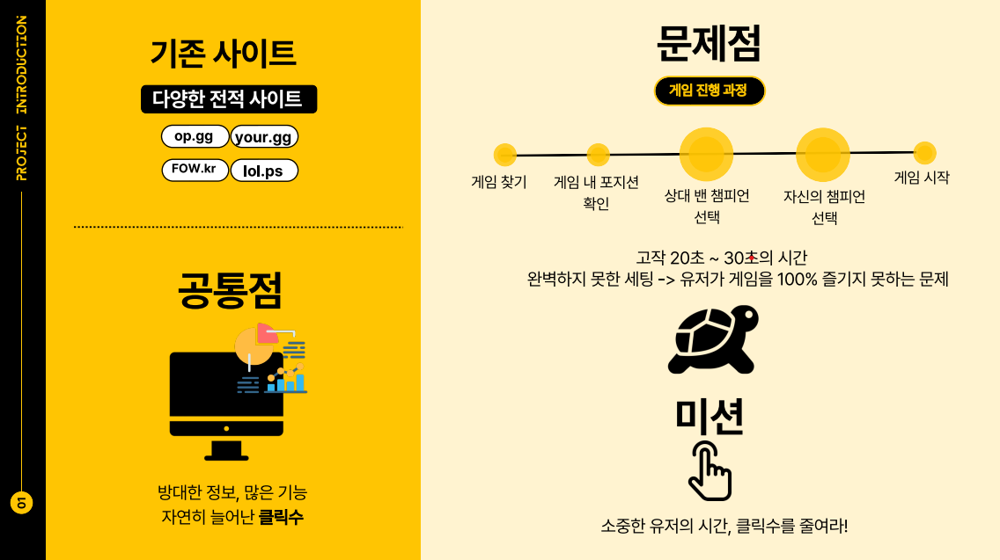

## 가제: lol 전적 사이트 프로젝트

<h2>기여자 (Collaborator) ✨</h2>
<table align="center">
  <tr>
    <td align="center">
      <a href="https://github.com/SilverWithA">
        
         
        
          <b>Euna Jeong</b>
        
      </a>
       
      <a href="https://github.com/SilverWithA" title="Code">🏠</a>
    </td>
    <td align="center">
      <a href="https://github.com/Hoonscucci">
        
         
        
          <b>hoonscucci</b>
        
      </a>
       
      <a href="https://github.com/Hoonscucci" title="Code">🏠</a>
    </td>
    <td align="center">
      <a href="https://github.com/chan9511">
        
         
        
          <b>chan9511</b>
        
      </a>
       
      <a href="https://github.com/chan9511" title="Code">🏠</a>
    </td>
  </tr>
</table>

<h3>Skills</h1>

	
<a>Communication<a>

	
	
	
	
<a>Front End<a>

	
	
	
	
	
 	
<a>Back End<a>

	
	
 	
 	
 	
<a>DataBase<a>

	
	
	
	

<h1>프로젝트 기간 : 2023.08.21 ~ 2023.10.24</h1>

	
<b>일정 로드맵</b>

	  

		  <ul>
		
		  </ul>

<h1>프로젝트 소개</h1>

	
<b>서비스 소개</b>

* 대부분의 게이머들은 전적을 검색합니다. 
* 월간 최대 트래픽 3700만 규모인 전적검색 사이트도 존재하기 때문에 절대 무시할수 없는 시장이 되었습니다.
* 타 사이트들의 단점을 보완하여 클릭수를 줄여 빠르고 원하는 데이터를 쉽게 접할 수 있는 전적검색 사이트입니다.

	

	
<b>프로젝트 개요</b>

	  

		   
		  <ul>
		
			  <li>
				실제 사용자의 불편함이 서비스 개요의 시발점이 되었습니다.
			  </li>
			  <li>
				게임 이용 초기 설정시 빠르고 정확한 데이터 전달이 프로젝트의 큰 레이아웃이 되었습니다.
			  </li>
		  </ul>

	
<b>서비스 시나리오</b>

	  

		   
		  <ul>
		
			  <li>
				  기존 정보 제공 사이트의 경우 방대한 정보로 인하여 페이지 이동이 잦아 정보 확인에 불편함이 존재합니다.
			  </li>
			  <li>
				  이러한 불편함을 최소화 하고자 로그인시 개인 설정이 유지 가능한 위젯 페이지를 만들기로 하였습니다.
			  </li>
		  </ul>

[발표 자료 보러가기](./IMG/Final_Project_ppt_복사본.pdf)
